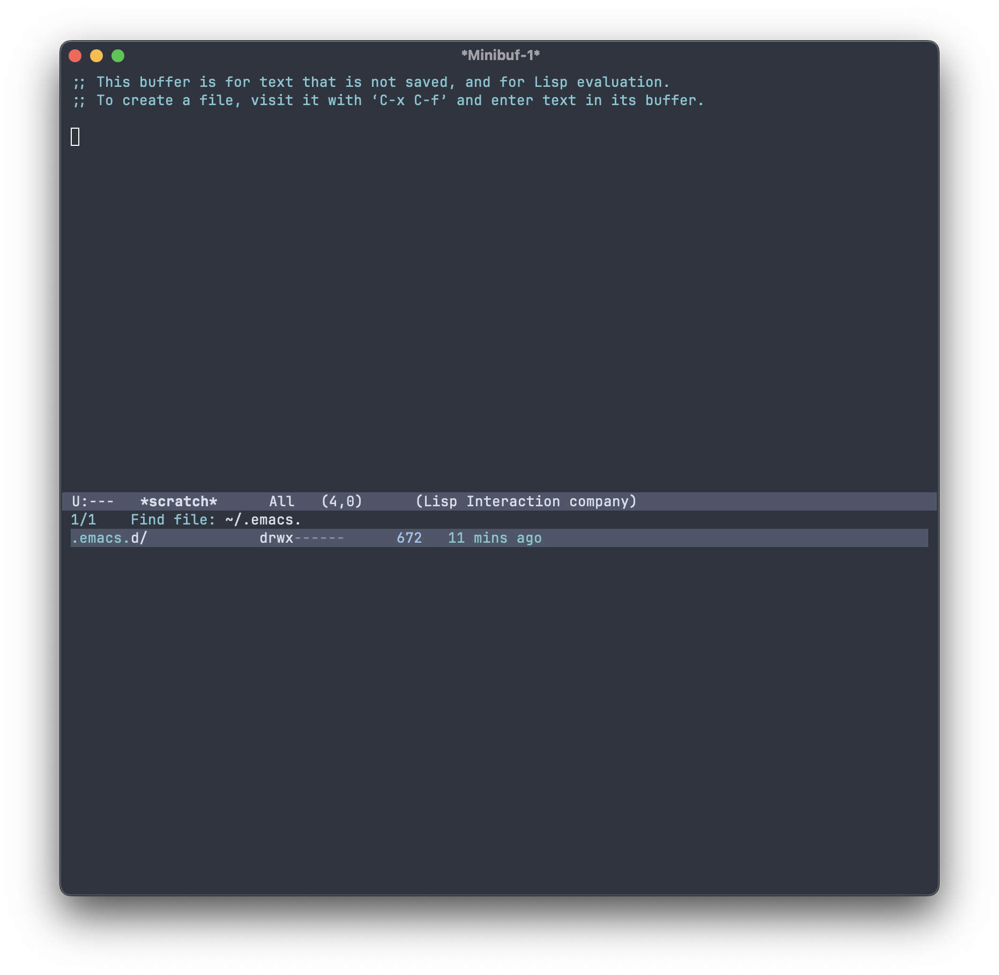
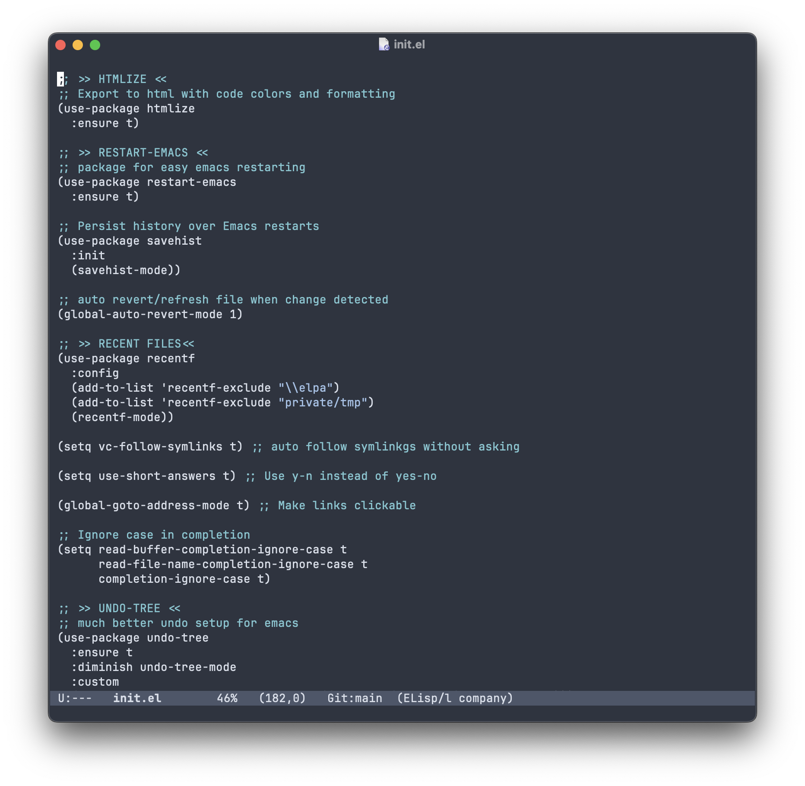
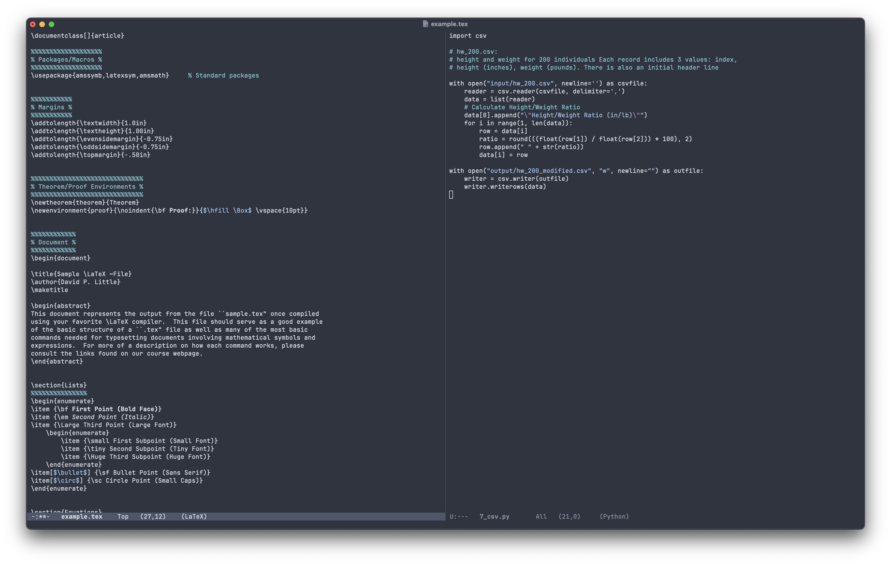

# Polar Bear ʕ•ᴥ•ʔ

Dark theme for Emacs loosely based on nord-like palette.

Has support for:

- Orderless
- Corfu
- Marginalia
- Company Mode
- Avy
- Undo-tree
- Magit

## Fake busy screenshots

### Scratch buffer and search

### init.el

### Two files side by side

